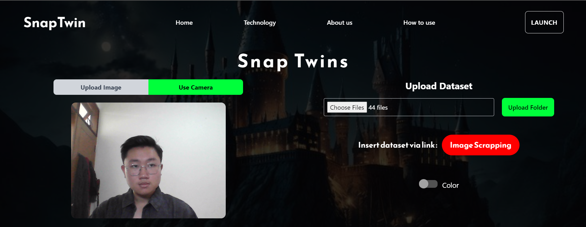

<h1 align="center"> Tugas Besar 2 IF2123 Aljabar Linear dan Geometri</h1>
<h1 align="center"> Kelompok 2 - TemanMasaKecil - Algeo02-22055 </h1>
<h1 align="center">  Content-Based Information Retrieval (CBIR)  </h1>


# SnapTwins
 Sebuah repositori yang berisi program yang mengimplementasikan **Sistem Temu Balik Gambar** atau  **CBIR** berbasis aplikasi **website** dengan cara mengekstraksi parameter **warna** dan **tekstur** dari suatu citra.
 
 ## Table of Contents
* [General Informations](#general-information)
* [Technologies Used](#technologies-used)
* [Features](#features)
* [Screenshots](#screenshots)
* [Setup](#setup)
* [Contact](#contact)
<!-- <!-- * [License](#license) -- -->

## General Information
- Program menerima masukan berupa **dataset** gambar baik dari **folder** maupun laman **website**
- Program menerima masukan **gambar** maupun menangkap gambar secara otomatis melalui fitur **kamera** sebagai **query**
- Pengguna memilih **algoritma CBIR** yang ingin digunakan, baik melalui parameter **warna** maupun **tekstur**
- Setelah pengguna memasukkan **dataset**, **query**, dan memilih **algoritma**, program akan menampilkan gambar dari dataset yang memiliki kemiripan **minimal 60%** dengan query berdasarkan **algoritma CBIR** yang dipilih.
<!-- You don't have to answer all the questions - just the ones relevant to your project. -->


## Technologies Used
1. Frontend
    - React
    - Tailwind
2. Backend
    - Python
    - Flask


## Features
- [Upload Photo by Drag and Drop](#upload-photo-by-image)
- [Upload Photo by Camera](#upload-photo-by-camera)
- [Upload Dataset by Folder](#upload-dataset-by-folder)
- [Upload Dataset by Web Scraping](#upload-dataset-by-webscraping)
- [Caching Image Features in JSON](#caching-image-features-in-json)
- [Download Result Report in PDF](#download-result-report-in-pdf)


## Screenshots
### Landing Page

<!-- If you have screenshots you'd like to share, include them here. -->
### Search Page

### Sample Search
#### **Upload Photo By Image**


#### **Upload Photo By Camera**



#### **Upload Dataset By Folder**


#### **Upload Dataset By WebScraping**


#### **Caching Image Features in JSON**

#### **Download Result Report in PDF**


## Setup
1. Setelah user berada di **root program** , user harus terlebih dahulu mengetik:
    ```bash
    cd src
    ```
    di terminal, kemudian:
    ```bash
    cd backend
    ```
    Setelah berada di path **backend**, user dapat membuat **virtual environment** bernama ‘env’ dengan menggunakan perintah 
    ```bash
    python -m venv env
    ```
    di terminal.

2. Setelah muncul folder **env**, pengguna kemudian dapat mengaktifkan **virtual Environment** dengan menggunakan perintah 
    ```bash
    env\Scripts\activate
    ```
    di terminal untuk pengguna **Windows** dan 
    ```bash
    env\bin\activate
    ```
    untuk pengguna **Mac**.

3. Kemudian user dapat menginstall requirement yang dibutuhkan program dengan menggunakan perintah 
    ```bash
    pip install -r requirements.txt
    ```
4. Setelah berhasil diinstal, user dapat menjalankan backend dengan cara 
    ```bash
    flask run --debug
    ```
5. Kemudian user dapat membuka terminal baru, lalu kemudian membuat perintah 
    ```bash
    cd src
    ```  
    kemudian 
    ```bash
    cd frontend 
    ```
6. Setelah berhasil masuk di path **frontend**, user dapat menjalankan website dengan menggunakkan perintah 
    ```bash
    npm run start
    ```
    Setelah itu web akan terbuka dan bisa dijalankan.

 - Repository : https://github.com/AlbertChoe/Algeo02-22055

## Struktur Program
```bash
.
└── src/
    ├── backend/
    │   ├── static/
    │   │   └── image
    │   ├── app.py
    │   ├── hitungcolor.py
    │   ├── hitungtexture.py
    │   ├── image_features.json
    │   ├── package-lock.json
    │   ├── search_results.json
    │   ├── READMEFLASK.md
    │   └── requirements.txt
    └── frontend/
        ├── public
        ├── src/
        │   ├── component/
        │   │   ├── AboutUs.js
        │   │   ├── Firstpage.js
        │   │   ├── Guide.js
        │   │   ├── Navbar.js
        │   │   ├── Search2.js
        │   │   └── Tech.js
        │   ├── App.css
        │   ├── App.js
        │   ├── index.css
        │   └── index.js
        └── tailwind.config.js
```
## Contact
1. [13522055 Benardo](https://github.com/Benardo07)
2. [13522091 Albert](https://github.com/AlbertChoe)
3. [13522115 Derwin Rustanly](https://github.com/DerwinRustanly)
